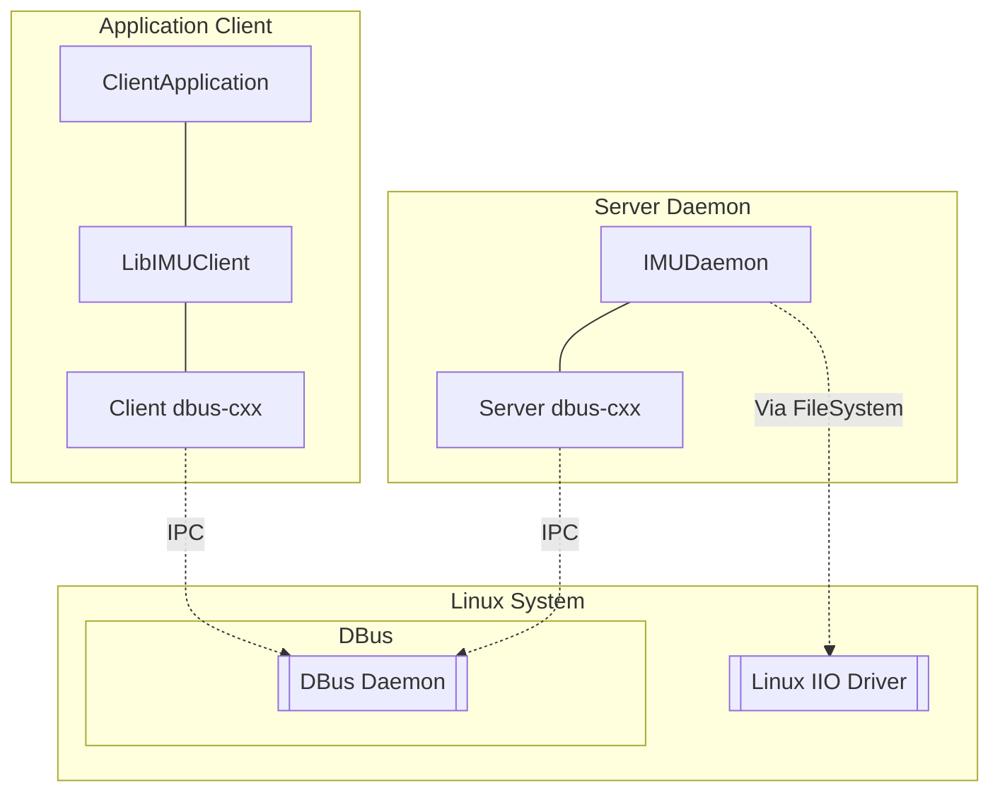

# Server and Client IMU based on RPC Communication

[](https://github.com/caiotoledo/imu-rpc/actions)
[](https://github.com/caiotoledo/imu-rpc/actions)
[](https://github.com/caiotoledo/imu-rpc/actions)
[](https://github.com/caiotoledo/imu-rpc/actions)

[](https://codecov.io/github/caiotoledo/imu-rpc?branch=master)

[](LICENSE.md)

Provides a library to interface with IMU using [Industrial IO](https://www.kernel.org/doc/html/v4.14/driver-api/iio/index.html) as a Daemon distributing it via [dbus-cxx](https://dbus-cxx.github.io/) (a [DBus](https://www.freedesktop.org/wiki/Software/dbus/) C++ Wrapper) to its clients.

## System Diagram



## Code Documentation
https://caiotoledo.github.io/imu-rpc/

## Dependencies

- [DBus-cxx](https://dbus-cxx.github.io/) version 0.12
  - [sigc++](https://github.com/libsigcplusplus/libsigcplusplus)
  - [dbus](https://www.freedesktop.org/wiki/Software/dbus/)
- [CMake](https://cmake.org/) 3.8 or greater
- [Google Test](https://github.com/google/googletest) version 1.8.1 (Only for Unit Test)

## Build and Install Project

```bash
cd <path_project>
mkdir .build
cd .build
cmake ../
make
sudo make install
```

Default File Location Install:
- Binaries: `/usr/bin/`
- Headers Libraries: `/usr/include/`
- Shared Libraries: `/usr/lib/`

## Running System

After [Building and Installing binaries](#Build-and-Install-Project) it's possible to start the imu daemon and test with the sample applications:

### **Start Daemon**

Start IMU Daemon running:
```bash
imu-daemon -d
```

Check the default configuration values using
```bash
imu-daemon --help
```

### **Execute Clients**

#### IMU Command Line Interface

Receive IMU data in command line:

```bash
imu-cli -a -c -g -e -t<TIMEOUT>
```
Show *Raw Accelerometer* (-a), *Raw Gyroscope* (-g), *Euler Angle* (-e) and *Complementary Filter Euler Angle* (-g) for `<TIMEOUT>` seconds (-t).

#### IMU Socket Interface

Send IMU Data via TCP/UDP socket:
```bash
imu-socket -d -p<PORT> -tu
```
Run application as daemon (-d) to provide IMU Data via *TCP* (-t) and *UDP* (-u) socket in port number `<PORT>` (-p).

Receive IMU Data via TCP/UDP socket:
```bash
python3 <PROJECT_PATH>/script/imu-dbus.py -a<IP> -p<PORT> -s<SOCKTYPE> -m -d
```
Show IMU Data received by `<SOCKTYPE>` socket (-s) from `<IP>` (-a) and `<PORT>` (-p) and display it in a MathPlot (-m) and in console (-d).

## Build and Execute Unit Test

Same steps as [Build and Install Project](#Build-and-Install-Project) but adding `-DBUILD_UNITTEST=1` in cmake command:

```bash
cd <path_project>
mkdir .build
cd .build
cmake -DBUILD_UNITTEST=1 ../
make
make test
```
